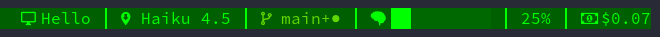
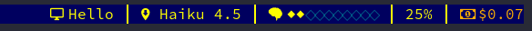
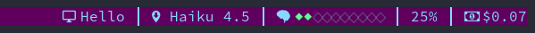

# Theme Gallery

All 14 built-in themes for tmux-opencode. Select any theme with:

    set -g @opencode-tmux-theme "<name>"

Screenshots are taken after `tmux source-file ~/.tmux.conf` with a live
OpenCode session running.

> **Font note** — most themes require a [Nerd Font](https://www.nerdfonts.com)
> installed and configured in your terminal emulator (JetBrainsMono NF and
> Hack NF are tested). The `neon-punk` theme uses emoji icons and works without
> Nerd Fonts. If glyphs render as boxes, switch to emoji fallbacks:
> `set -g @opencode-statusline-icon-model "🔮"`

---

## default

Plain tmux colours. Blue progress bar, all text inherits the terminal's
own foreground colour. Works on any terminal without configuration.

    set -g @opencode-tmux-theme "default"

---

## classic

Dark charcoal background, white text, dynamic green→yellow→red gradient bar.
Clean, professional dark terminal look.

    set -g @opencode-tmux-theme "classic"

---

## forest

Dark green background, bright green text, block bar. Includes session title.
Operator/dashboard feel.

    set -g @opencode-tmux-theme "forest"

---

## neon-punk

True black background, hot-pink text, heavy-circle `▰▱` bar. 80s spray-paint
wall neon. Uses emoji icons — no Nerd Font required for icons.

    set -g @opencode-tmux-theme "neon-punk"

---

## darkblue

Dark navy background, neon-yellow text, diamond `◆◇` bar. Night-city aesthetic.

    set -g @opencode-tmux-theme "darkblue"

---

## cyberpunk

True black background, hot-magenta text, neon-yellow filled `▰▱` bar, electric-cyan
branch, orange cost. Classic cyberpunk neon city palette: magenta + yellow + cyan.

    set -g @opencode-tmux-theme "cyberpunk"

---

## retrowave

Deep purple background, hot-pink text, electric-cyan rectangular `▮▯` bar,
gold cost. 80s synthwave sunset palette.

    set -g @opencode-tmux-theme "retrowave"

---

## steel

Dark charcoal background, steel-blue text, block bar. Cool industrial aesthetic.

    set -g @opencode-tmux-theme "steel"

---

## orange

Grey background, warm orange text, dot `●○` bar, amber empty dots.

    set -g @opencode-tmux-theme "orange"

---

## minimal

Dark background, cyan text. Model, percentage and cost only — no progress bar.
Maximum status bar width efficiency.

    set -g @opencode-tmux-theme "minimal"

---

## redalert

White background, bright red text, heavy-circle `▰▱` bar. For urgency signalling
or high-contrast visibility.

    set -g @opencode-tmux-theme "redalert"

---

## matrix

True black background, bright green text, heavy-circle `▰▱` bar with green fill
and dark-green empty. Matrix digital-rain feel.

    set -g @opencode-tmux-theme "matrix"

---

## diamond

Deep purple background, cyan text, green diamond `◆◇` bar. Rich purple and cyan
palette.

    set -g @opencode-tmux-theme "diamond"

---

## purple

Dark charcoal background, light-purple text, rectangular `▮▯` bar with purple fill
and slate empty.

    set -g @opencode-tmux-theme "purple"

---

## Customising a theme

Override any individual setting after setting the theme name:

    set -g @opencode-tmux-theme "matrix"

    # Override a single colour
    set -g @opencode-statusline-cost-fg "colour82"

    # Change bar width
    set -g @opencode-statusline-bar-width "15"

    # Use emoji instead of Nerd Font icon
    set -g @opencode-statusline-icon-model "🔮"

    # Use the gradient instead of the theme's fixed bar colour
    set -gu @opencode-statusline-bar-filled-color

User options (`@opencode-statusline-*`) always win over theme defaults.
See [docs/dev-guide.md](dev-guide.md) for the full list of available options.
