# Theme Gallery

All 13 built-in themes for tmux-opencode. Select any theme with:

    set -g @opencode-tmux-theme "<name>"

Screenshots are taken after `tmux source-file ~/.tmux.conf` with a live
OpenCode session running.

> **Font note** — most themes require a [Nerd Font](https://www.nerdfonts.com).
> The `neon-punk` theme uses emoji icons and works without Nerd Fonts.
> If glyphs render as boxes, either install a Nerd Font or switch icons:
> `set -g @opencode-statusline-icon-model "✨"`

---

## default

Plain tmux colours. Nerd Font icons. Green→yellow→red gradient bar.

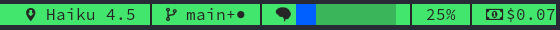

    set -g @opencode-tmux-theme "default"

---

## classic

Dark charcoal background, white text, block bar with dynamic gradient.

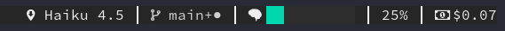

    set -g @opencode-tmux-theme "classic"

---

## dashboard

Dark green background, bright-green text. Includes session title.

    set -g @opencode-tmux-theme "dashboard"

---

## neon-punk

True black, hot-pink text. 80s spray-paint wall neon. Emoji icons.
No Nerd Font required for icons.

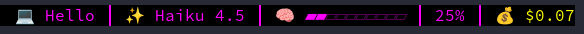

    set -g @opencode-tmux-theme "neon-punk"

---

## cyberpunk

Dark navy, neon-yellow text, diamond bar. Night-city aesthetic.

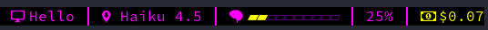

    set -g @opencode-tmux-theme "cyberpunk"

---

## retrowave

Deep purple, hot-pink text, electric-cyan rectangular bar. Synthwave sunset.

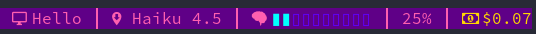

    set -g @opencode-tmux-theme "retrowave"

---

## steel

Dark background, steel-blue text, block bar.

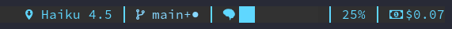

    set -g @opencode-tmux-theme "steel"

---

## orange

Grey background, warm-orange text, dot `●○` progress bar.

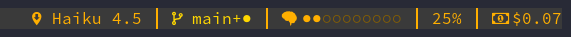

    set -g @opencode-tmux-theme "orange"

---

## minimal

Dark background, cyan text. No progress bar — maximum width efficiency.

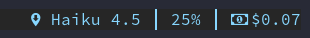

    set -g @opencode-tmux-theme "minimal"

---

## redalert

White background, bright-red text, heavy-circle bar. Urgency signalling.

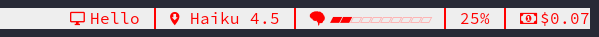

    set -g @opencode-tmux-theme "redalert"

---

## matrix

True black, bright-green text, heavy-circle bar. Matrix digital-rain feel.

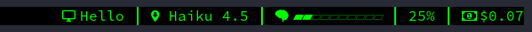

    set -g @opencode-tmux-theme "matrix"

---

## dracula

Dracula colour palette (no Dracula plugin required). Deep purple, cyan text,
green diamond bar.

    set -g @opencode-tmux-theme "dracula"

---

## purple

Dark Dracula-inspired background, light-purple text, purple rectangular bar.

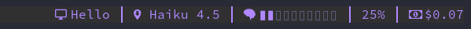

    set -g @opencode-tmux-theme "purple"

---

## Customising a theme

Override any individual setting after setting the theme:

    set -g @opencode-tmux-theme "matrix"

    # Use a brighter green for cost only
    set -g @opencode-statusline-cost-fg "colour82"

    # Change bar width
    set -g @opencode-statusline-bar-width "15"

    # Use emoji instead of Nerd Font icon
    set -g @opencode-statusline-icon-model "✨"

User options (`@opencode-statusline-*`) always override theme defaults.
