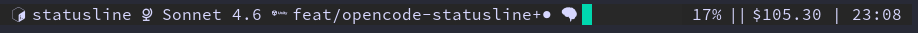
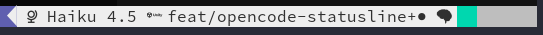
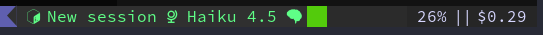
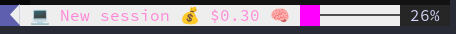
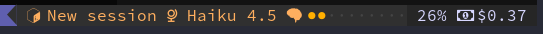
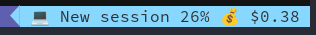
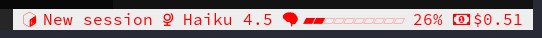
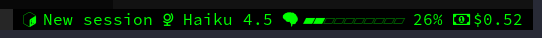
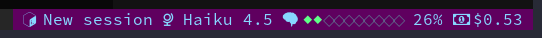
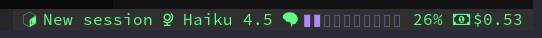

# Examples

Visual showcase of all available presets. Each preset includes a ready-to-use
config you can copy into `~/.tmux.conf` or source directly.

> **Font note** — presets 1–10 use [Nerd Font](https://www.nerdfonts.com)
> glyphs for icons and progress bar characters. Install any Nerd Font
> (JetBrainsMono NF and Hack NF are tested) and configure your terminal
> emulator to use it. Preset 0 works with any font; swap to emoji fallback
> icons if glyphs render as boxes (see [Icons](../README.md#icons)).

---

## Preset 0 — Raw tmux

Plain tmux, no theme plugin required. Default gradient bar.



```bash
# source examples/preset-0-raw-tmux.conf
set -g @opencode-statusline-refresh 5
set -g @opencode-statusline-plugins "model branch progressbar percentage cost"

set -gu @opencode-statusline-bar-filled-color
set -g  @opencode-statusline-bar-filled-char "█"
set -g  @opencode-statusline-bar-empty-char  "░"
set -g  @opencode-statusline-bar-empty-color "colour236"
```

---

## Preset 1 — Classic

Dracula theme · white text on dark-grey segment · gradient block bar.



> Requires: Dracula tmux theme + `custom:opencode-statusline` in `@dracula-plugins`

```bash
# source examples/preset-1-classic.conf
set -g @dracula-plugins              "cpu-usage battery time custom:opencode-statusline"
set -g @dracula-custom-plugin-colors "white dark_gray"

set -g @opencode-statusline-refresh  5
set -g @opencode-statusline-plugins  "model branch progressbar percentage cost"

set -gu @opencode-statusline-bar-filled-color
set -g  @opencode-statusline-bar-filled-char "█"
set -g  @opencode-statusline-bar-empty-char  "░"
set -g  @opencode-statusline-bar-empty-color "colour236"
set -g  @opencode-statusline-text-color      "colour255"
```

---

## Preset 2 — Session Dashboard

Dracula theme · dark text on green segment · session-title aware.



> Requires: Dracula tmux theme + `custom:opencode-statusline` in `@dracula-plugins`

```bash
# source examples/preset-2-session-dashboard.conf
set -g @dracula-plugins              "cpu-usage battery time custom:opencode-statusline"
set -g @dracula-custom-plugin-colors "dark_gray green"

set -g @opencode-statusline-refresh 2
set -g @opencode-statusline-plugins "session model branch progressbar percentage cost"

set -g @opencode-statusline-bar-filled-color "colour46"
set -g @opencode-statusline-bar-filled-char  "█"
set -g @opencode-statusline-bar-empty-char   "░"
set -g @opencode-statusline-bar-empty-color  "colour22"
set -g @opencode-statusline-text-color       "colour232"
```

---

## Preset 3 — Neon Punk

Dracula theme · white text on pink segment · emoji icons.



> Requires: Dracula tmux theme + `custom:opencode-statusline` in `@dracula-plugins`

```bash
# source examples/preset-3-neon-punk.conf
set -g @dracula-plugins              "cpu-usage battery time custom:opencode-statusline"
set -g @dracula-custom-plugin-colors "white pink"

set -g @opencode-statusline-refresh 2
set -g @opencode-statusline-plugins "session model progressbar percentage cost"

set -g @opencode-statusline-bar-filled-color "colour201"
set -g @opencode-statusline-bar-filled-char  "█"
set -g @opencode-statusline-bar-empty-char   "░"
set -g @opencode-statusline-bar-empty-color  "colour236"
set -g @opencode-statusline-text-color       "colour255"

set -g @opencode-statusline-icon-model   "✨"
set -g @opencode-statusline-icon-bar     "🧠"
set -g @opencode-statusline-icon-cost    "💰"
set -g @opencode-statusline-icon-session "💻"
```

---

## Preset 4 — Steel Blue

Dracula theme · white text on dark-purple segment · steel-blue fixed bar.


> Requires: Dracula tmux theme + `custom:opencode-statusline` in `@dracula-plugins`

```bash
# source examples/preset-4-steel-blue.conf
set -g @dracula-plugins              "cpu-usage battery time custom:opencode-statusline"
set -g @dracula-custom-plugin-colors "white dark_purple"

set -g @opencode-statusline-refresh 5
set -g @opencode-statusline-plugins "model branch progressbar percentage cost"

set -g @opencode-statusline-bar-filled-color "colour81"
set -g @opencode-statusline-bar-filled-char  "█"
set -g @opencode-statusline-bar-empty-char   "░"
set -g @opencode-statusline-bar-empty-color  "colour237"
set -g @opencode-statusline-text-color       "colour255"
```

---

## Preset 5 — Orange Dots

Dracula theme · dark text on orange segment · dot-style bar.



> Requires: Dracula tmux theme + `custom:opencode-statusline` in `@dracula-plugins`

```bash
# source examples/preset-5-orange-dots.conf
set -g @dracula-plugins              "cpu-usage battery time custom:opencode-statusline"
set -g @dracula-custom-plugin-colors "dark_gray orange"

set -g @opencode-statusline-refresh 5
set -g @opencode-statusline-plugins "model branch progressbar percentage cost"

set -g @opencode-statusline-bar-filled-color "colour214"
set -g @opencode-statusline-bar-filled-char  "●"
set -g @opencode-statusline-bar-empty-char   "○"
set -g @opencode-statusline-bar-empty-color  "colour236"
set -g @opencode-statusline-text-color       "colour232"
```

---

## Preset 6 — Minimal

Dracula theme · cyan text on dark-grey segment · no progress bar.



> Requires: Dracula tmux theme + `custom:opencode-statusline` in `@dracula-plugins`

```bash
# source examples/preset-6-minimal.conf
set -g @dracula-plugins              "cpu-usage battery time custom:opencode-statusline"
set -g @dracula-custom-plugin-colors "cyan dark_gray"

set -g @opencode-statusline-refresh 5
set -g @opencode-statusline-plugins "model percentage cost"
```

---

## Preset 7 — Red Alert

Raw tmux · white background · bright-red text · heavy-circle `▰▱` bar.



> Requires: Nerd Font (JetBrainsMono NF or Hack NF)  
> Raw tmux — no Dracula theme needed.

```bash
# source examples/preset-7-red-alert.conf
set -g @opencode-statusline-refresh 2
set -g @opencode-statusline-plugins "session model progressbar percentage cost"

set -g @opencode-statusline-bar-filled-color "colour196"
set -g @opencode-statusline-bar-filled-char  "▰"
set -g @opencode-statusline-bar-empty-char   "▱"
set -g @opencode-statusline-bar-empty-color  "colour217"
set -g @opencode-statusline-text-color       "colour196"

set -g status-style        "bg=colour255,fg=colour196"
set -g status-right-length 200
set -g status-right        "#[bg=colour255,fg=colour196] #(~/.tmux/plugins/tmux/scripts/opencode-statusline) "
```

---

## Preset 8 — Matrix

Raw tmux · true-black background · bright-green text · heavy-circle `▰▱` bar.



> Requires: Nerd Font (JetBrainsMono NF or Hack NF)  
> Raw tmux — no Dracula theme needed.

```bash
# source examples/preset-8-matrix.conf
set -g @opencode-statusline-refresh 2
set -g @opencode-statusline-plugins "session model progressbar percentage cost"

set -g @opencode-statusline-bar-filled-color "colour46"
set -g @opencode-statusline-bar-filled-char  "▰"
set -g @opencode-statusline-bar-empty-char   "▱"
set -g @opencode-statusline-bar-empty-color  "colour22"
set -g @opencode-statusline-text-color       "colour46"

set -g status-style        "bg=colour16,fg=colour46"
set -g status-right-length 200
set -g status-right        "#[bg=colour16,fg=colour46] #(~/.tmux/plugins/tmux/scripts/opencode-statusline) "
```

---

## Preset 9 — Dracula Glyph

Raw tmux · deep-purple background · cyan text · green-filled `◆◇` diamond bar.



> Requires: Nerd Font (JetBrainsMono NF or Hack NF)  
> Raw tmux — no Dracula theme needed.

```bash
# source examples/preset-9-dracula-glyph.conf
set -g @opencode-statusline-refresh 2
set -g @opencode-statusline-plugins "session model progressbar percentage cost"

set -g @opencode-statusline-bar-filled-color "colour84"
set -g @opencode-statusline-bar-filled-char  "◆"
set -g @opencode-statusline-bar-empty-char   "◇"
set -g @opencode-statusline-bar-empty-color  "colour60"
set -g @opencode-statusline-text-color       "colour117"

set -g status-style        "bg=colour53,fg=colour117"
set -g status-right-length 200
set -g status-right        "#[bg=colour53,fg=colour117] #(~/.tmux/plugins/tmux/scripts/opencode-statusline) "
```

---

## Preset 10 — Dracula Purple + Green

Raw tmux · dark Dracula background · bright-green text · light-purple `▮▯` rectangular bar.



> Requires: Nerd Font (JetBrainsMono NF or Hack NF)  
> Raw tmux — no Dracula theme needed.

```bash
# source examples/preset-10-dracula-purple-green.conf
set -g @opencode-statusline-refresh 2
set -g @opencode-statusline-plugins "session model progressbar percentage cost"

set -g @opencode-statusline-bar-filled-color "colour141"
set -g @opencode-statusline-bar-filled-char  "▮"
set -g @opencode-statusline-bar-empty-char   "▯"
set -g @opencode-statusline-bar-empty-color  "colour60"
set -g @opencode-statusline-text-color       "colour84"

set -g status-style        "bg=colour236,fg=colour84"
set -g status-right-length 200
set -g status-right        "#[bg=colour236,fg=colour84] #(~/.tmux/plugins/tmux/scripts/opencode-statusline) "
```
